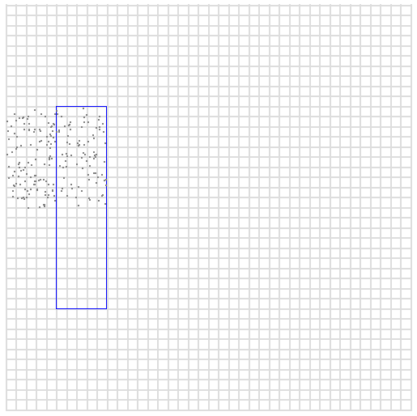

# Secondary indexing
Redis에서 세컨더리 인덱스를 사용하는 방법

Redis는 값에 여러 복잡한 자료 구조들이 들어갈 수 있기 때문에, 정확히는 키-값 저장소는 아닙니다. 하지만, 외부적으로
키-값 쉘을 가지고 있습니다: API 수준에서는 키의 이름으로 접근합니다. Redis는 프라이머리 키만을 통한 접근을 허용한다고
해도 무방합니다. 하지만, Redis는 data structures 서버로서 이를 활용해 다양한 형태의 보조 인덱스를 생성하고, 복합
인덱스도 생성이 가능합니다.

이 문서는 다음의 자료 구조들을 가지고 Redis가 어떻게 인덱스를 생성하는지 설명합니다:
- 해시, JSON은 다양한 필드 타입을 가지고 있고, Redis query 엔진과 함께 사용됩니다.
- Sorted Set은 ID나 다른 숫자형 필드들을 가지고 보조 인덱스를 생성합니다.
- Sorted Set을 사전식 범위와 사용하면, 좀 더 발전된 보조 인덱스, 복합 인덱스, 그래프 탐색 인덱스를 사용할 수 있습니다.
- Set으로 무작위 인덱스를 생성합니다.
- List는 단순한 반복 인덱스나, 최신 N개 항목에 대한 인덱스를 생성할 수 있습니다.
- 시계열에 라벨 인덱스를 생성할 수 있습니다.

Redis를 가지고 인덱스를 생성하고 관리하는 것은 심화 주제입니다. 복잡한 쿼리를 사용해야 하는 경우에는 관계형 저장소가
더 적합한지 알아보아야 합니다. 하지만, 특히 캐싱이 필요한 상황에서는 빠른 조회를 위해 인덱싱된 데이터를 Redis에 저장해야
할 필요가 있습니다. 이는 실행을 위해 인덱스가 필요한 일반적인 쿼리 성능을 높이기 위해서입니다.

## Hashes and JSON indexes
***
Redis query 엔진은 다양한 형태의 필드를 가지고 JSON 키, 해시 모두를 인덱싱할 수 있게 해줍니다:
- TEXT
- TAG
- NUMERIC
- GEO
- VECTOR
- GEOSHAPE

`FT.CREATE`를 통해 해시와 JSON 키에 인덱스가 추가되면, 인덱스에 추가된 접두사를 사용하는 키들은 `FT.SEARCH`와
`FT.AGGREGATE` 통해 질의될 수 있습니다.

해시와 JSON 인덱스 생성에 더 많은 정보를 보고 싶으시다면 다음의 페이지들을 참조해주세요.
- [Hash indexes](https://redis.io/docs/latest/develop/ai/search-and-query/indexing/schema-definition/)
- [JSON indexes](https://redis.io/docs/latest/develop/ai/search-and-query/indexing/)

## Simple numerical indexes with sorted sets
***
Redis를 통해 생성할 수 있는 가장 간단한 보조 인덱스는 Sorted Set을 사용하는 것입니다. Sorted Set은 각 요소에
점수를 바탕으로 오름차순 정렬이 이루어집니다.

이때 점수가 배정밀도 부동소수점이기 때문에, 일반적인 Sorted Set으로 만들 수 있는 인덱스는 특정 범위의 숫자 값을 갖는
필드를 기준으로만 인덱스를 생성할 수 있습니다.

이러한 인덱스를 만드는 두 명령어는 `ZADD`와 `ZRANGE`입니다. `ZRANGE`는 `BYSCORE` 인자를 통해 지정한 범위 내의
요소들을 조회할 수 있습니다.

예를 들어, 사람 이름의 집합을 나이로 sorted set을 활용해 인덱싱할 수 있습니다. 요소는 사람의 이름이고, 점수는 나이입니다.
~~~redis
ZADD myindex 25 Manuel
ZADD myindex 18 Anna
ZADD myindex 35 Jon
ZADD myindex 67 Helen
~~~

20세에서 40세 사이의 사람들을 조회하기 위해서는 다음과 같이 명령하면 됩니다:
~~~redis
ZRANGE myindex 20 40 BYSCORE
1) "Manuel"
2) "Jon"
~~~

`ZRANGE`의 `WITHSCORES` 옵션을 통해 반환된 요소들의 점수도 같이 조회가 가능합니다.

`ZCOUNT`는 주어진 범위 요소들의 개수를 조회합니다. 실제 요소들을 가져오지 않고, 개수만 반환하기 때문에 효율적이며,
범위의 크기와 상관없이 로그 시간안에 수행됩니다.

범위는 포함적일 수도 있고, 예외적일 수도 있습니다. 다음의 `ZRANGE` [문서](https://redis.io/docs/latest/commands/zrange/)를 참고하세요.

참고: `ZRANGE`를 `BYSCORE`와 `REV` 인자와 함께 사용하는 경우, 범위를 역순으로 질의하는 것도 가능합니다. 이는
데이터가 특정 방향(오른차순 또는 내림차순)으로 인덱싱되어 있을 때, 반대 방향으로 데이터를 조회하고 싶을 때 유용합니다.

### Use object IDs as associated values
위의 예시에서는 이름을 나이에 묶었습니다. 하지만, 일반적으로는 인덱싱하려는 필드와 관련된 실제 데이터가 다른 곳에 저장되어
있을 수 있습니다. 이럴 경우, sorted set의 값에 해당 데이터를 직접 저장하는 대신, 그 객체의 ID만 저장할 수도 있습니다.

예를 들어, 사용자들을 대표하는 Redis 해시가 있습니다. 각 사용자는 단일 키로 표현이 되며, ID로 바로 접근할 수 있습니다:
~~~redis
HMSET user:1 id 1 username antirez ctime 1444809424 age 38
HMSET user:2 id 2 username maria ctime 1444808132 age 42
HMSET user:3 id 3 username jballard ctime 1443246218 age 33
~~~

사용자들의 나이로 질의할 수 있게 인덱스를 만들고 싶다면 다음과 같이 할 수 있습니다:
~~~redis
ZADD user.age.index 38 1
ZADD user.age.index 42 2
ZADD user.age.index 33 3
~~~

이번에는 점수에 연관된 값이 객체의 ID입니다. 띠라서 `ZRANGE`와 `BYSCORE`로 인덱스를 질의를 하면, `HGETALL` 또는
비슷한 명령어들로 필요한 정보들을 추가로 조회해야 합니다. 장점은 인덱스를 건들지 않고도 객체들을 수정할 수 있다는 것입니다
(인덱싱된 필드를 건드리지만 않는다면).

다음의 예시들에서는 인덱스에 연결된 값으로 ID를 거의 사용할 것입니다. 일부 예외적인 경우를 빼면 일반적인 경우이기 때문입니다.

### Update simple sorted set indexes
시간에 따라 변하는 값을 종종 인덱싱하기도 합니다. 위의 예시에서는 사용자들의 나이는 매년 바뀝니다. 이러한 경우에서는 
나이 그 자체보다는 출생년월일에 인덱싱을 적용하는 것이 맞을 수도 있습니다. 하지만 다른 상황에서는 특정 필드가 가끔씩 변경되며,
그에 따라 인덱스도 함께 갱신되길 원하는 경우도 있습니다.

`ZADD` 명령어는 단순한 인덱스를 갱신하는 것을 매우 간단하게 만들어줍니다. 같은 요소를 다른 점수로 추가하면, 해당 요소를
맞는 순위로 옮기고, 점수를 갱신합니다. 따라서, 만약 antirez가 39세가 되면, 해당 사용자를 나타내는 해시 정보와 인덱스를
갱신하기 위해 다음의 두 명령어들을 실행하면 됩니다:
~~~redis 
HSET user:1 age 39
ZADD user.age.index 39 1
~~~

이 작업은 MULTI/EXEC 트랜잭션으로 묶어 실행함으로써, 두 필드가 모두 함께 수정되거나, 전혀 수정되지 않도록 보장할 수 있습니다.

### Limits of the score
Sorted set의 요소들의 점수는 배정밀도 부동소수(double precision float)입니다. 이것은 내부적으로 지수 표현을 사용하기 
때문에 다양한 소수와 정수형 값들을 표현할 수 있지만, 정밀도에 따라 오차가 발생할 수 있습니다. 그러나, 인덱싱 측면에서
중요한 점은 -9007199254740992 ~ 9007199254740992(-/+ 2^53) 사이의 숫자들은 오차없이 표현할 수 있습니다.

## Time series indexes
***
`TS.CREATE`로 새로운 시계열을 만들면, 하나 이상의 라벨을 연결할 수 있습니다. 각 라벨은 키-이름 쌍이며, 이름과 값 모두 텍스트로 이루어집니다.
라벨은 보조 인덱스 역할을 하며, 다양한 시계열 명령어를 사용하여 시계열 키들에 대해 질의를 수행할 수 있게 해줍니다.

[Time series quickstart guide](https://redis.io/docs/latest/develop/data-types/timeseries/#create-a-time-series)를 통해
시계열을 라벨과 함께 생성하는 예제를 살펴보세요.

`TS.MGET`, `TS.MRANGE`, `TS.MREVRANGE`는 지정된 라벨이나 라벨과 관련된 필터 표현식을 기반으로 여러 시계열에 대해 동작합니다.
`TS.QUERYINDEX`는 주어진 라벨 표현식에 맞는 모든 시계열 키를 반환합니다.

## Lexicographical indexes
***
Redis Sorted Set은 흥미로운 특성을 가지고 있습니다. 같은 점수를 가진 요소가 추가되면 `memcmp()` 함수를 통해 문자열을 이진 데이터로 비교해
사전순으로 정렬합니다.

C 언어를 모르거나 `memcmp()` 함수를 모르시는 분들을 위하자면, 동일한 점수를 가진 요소들은 각각의 바이트 값을 순서대로 비교하며 정렬됩니다.
만약, 첫 번째 바이트가 같으면, 두 번째가 비교되고, 순차적으로 이어집니다. 두 문자열이 동일한 접두어를 가지고 있다면, 더 긴 문자열이 더 큰 것으로
간주됩니다. ("foobar" > "foo")

`ZRANGE`, `ZLEXCOUNT`같은 명령어는 Sorted Set 내에서 모든 요소가 동일한 점수를 가지고 있으면, 사전순을 기반으로 범위를 질의하거나,
개수를 셀 수 있습니다. 

이 기능은 전통적인 데이터베이스에서 인덱스를 구현하기 위해 사용되는 B-tree하고 기본적으로 동일합니다. 이것때문에, Redis 자료구조를 가지고
여러 멋진 인덱스를 구현할 수 있습니다.

사전식 인덱스를 더 알아보기 전에, Sorted Set이 이 특별한 모드에서 어떻게 동작하는지 확인해봅시다. 동일한 점수를 가진 요소들만을 추가해야하므로,
특별한 점수인 0으로 넣겠습니다.
~~~redis
ZADD myindex 0 baaa
ZADD myindex 0 abbb
ZADD myindex 0 aaaa
ZADD myindex 0 bbbb
~~~

바로 sorted set에서 모든 요소들을 조회해보면, 사전순으로 정렬된 것을 확인할 수 있습니다.
~~~redis
ZRANGE myindex 0 -1
1) "aaaa"
2) "abbb"
3) "baaa"
4) "bbbb
~~~

이제 `ZRANGE`를 `BYLEX` 인자와 함께 사용하여 범위 질의를 할 수 있습니다.
~~~redis
ZRANGE myindex [a (b BYLEX
1) "aaaa"
2) "abbb"
~~~

범위 쿼리에서 최솟값과 최댓값 앞에 특별한 문자인 '['와 '('에 주목하세요. 이 접두어들은 필수적이며, 포함 범위인지 예외 범위인지 명시합니다.
따라서, `[a (b`는 a를 이상 b미만의 모든 요소들을 사전순으로 정렬된 형태로 반환하라는 뜻입니다. 즉, a로 시작하는 모든 요소입니다.

또한, 무한히 작은 문자열과 무한히 큰 문자열을 나타내는 '-'와 '+'도 있습니다.
~~~redis
ZRANGE myindex [b + BYLEX
1) "baaa"
2) "bbbb"
~~~

기본적으로 이게 전부입니다. 이제 이러한 기능들을 활용해서 인덱스를 생성하는 방법에 대해 알아봅시다.

### A first example: completion
인덱싱의 흥미로운 활용 방법에는 자동 완성이 있습니다. 자동 완성은 검색 엔진에 타이핑할때 보실 수 있는 그것 맞습니다: 인터페이스에서 사용자가 
어떤 것을 타이핑하는지 예상하여, 동일한 문자로 시작하는 질의들을 제공합니다.

이것에 대한 단순한 접근 방식은 인덱스에 사용자가 입력한 모든 쿼리를 추가하는 것입니다. 예를 들어, 사용자가 banana를 검색하면, 다음과 같이 합니다:
~~~redis
ZADD myindex 0 banana
~~~

이런 방식으로 모든 검색 쿼리에 이를 적용합니다. 그 다음, 사용자의 입력을 완성하고자 할때, `ZRANGE`를 `BYLEX`인자와 함께 사용하여 범위 질의를
합니다. 사용자가 검색창에 "bit"을 입력하고 있다고 가정하고, "bit"으로 시작하는 검색 키워드들을 제안하고 싶다면, 다음과 같은 Redis 명령어를
실행하면 됩니다:
~~~redis
ZRANGE myindex "[bit" "[bit\xff" BYLEX
~~~

기본적으로, 사용자가 입력 중인 문자열의 범위를 시작으로 사용하고, 동일한 문자열 뒤에 바이트 값 255를 덧붙인(예시에서는 "\xff") 문자열을
범위의 끝으로 하여 범위를 생성합니다. 이런 방식으로 사용자가 입력하고 있는 문자열을 시작으로 하는 모든 문자열을 조회할 수 있습니다.

`LIMIT` 옵션을 활용하여 결과에 제한을 두어 너무 많은 데이터를 반환받는 것을 방지할 수 있습니다.

### Add frequency into the mix
위의 접근방식은 살짝 단순합니다. 모든 유저의 검색 결과가 이런 방식으로는 동일할 것이기 때문이죠. 실제 시스템에서는 검색 빈도를 가지고 자동 완성
기능을 제공합니다: 가장 많이 검색되는 것들이 드물게 검색되는 것들보다 더 높은 확률로 제안됩니다.

빈도에 기반해서 자동 완성을 구현하고, 그와 동시에 향후 입력에도 자동으로 적용되고, 인기가 없는 검색들을 제거하기 위해서는 스트리밍 알고리즘을
사용할 수 있습니다.

가장 먼저, 인덱스를 수정해야 합니다. 이는 검색어만을 저장하기 위해서가 아니라, 해당 검색어와 연관된 빈도도 같이 저장하기 위함입니다. 그래서
`banana`를 추가하는 것이 아닌 `banana:1`을 추가합니다. 여기서 1은 빈도입니다.
~~~redis
ZADD myindex 0 banana:1
~~~

검색어가 이미 인덱스에 존재하면 빈도를 늘려주는 로직도 필요합니다. 다음과 같이 구현할 수 있습니다:
~~~redis
ZRANGE myindex "[banana:" + BYLEX LIMIT 0 1
1) "banana:1"
~~~

위의 명령어는 `banana`에 해당하는 항목이 존재하면 하나를 반환할 것입니다. 그러면 이제 빈도를 증가시키기 위해서 다음의 두 명령어를 보냅니다:
~~~redis
ZREM myindex 0 banana:1
ZADD myindex 0 banana:2
~~~

주의할 점은 위의 인덱스에 대해 동시적인 접근이 발생할 수 있다는 것입니다. 위의 3 명령어는 Lua Script로 실행해야, 원자적으로 기존 값을 읽어온
다음 값을 증가시킬 수 있습니다.

> Redis 이벤트 루프는 Lua Script를 단일 명령어로 취급해 원자적인 연산이 가능하다.

그 결과로 사용자가 검색할 때마다 값이 증가됩니다.

추가로 고려해야 할 사항이 더 있습니다: 자주 검색되는 검색어들만 남기고 싶기 때문에, 비인기 항목들은 일정한 방식으로 제거를 해주어야 합니다.
사용자의 입력을 자동 완성하기 위해 인덱스를 조회할 때 다음과 같은 것을 볼 수 있습니다:
~~~redis
ZRANGE myindex "[banana:" + BYLEX LIMIT 0 10
1) "banana:123"
2) "banaooo:1"
3) "banned user:49"
4) "banning:89"
~~~

보시다시피 `bannaoo`는 비인기 항목입니다. 하지만, 한 번 조회된 이력이 있기 때문에 이것을 그대로 사용자에게 보여주게 됩니다.

다음과 같이 처리할 수 있습니다. 반환된 값들 중, 하나를 무작위하게 골라서 값을 하나 감소시킨 다음 추가시키는 것입니다. 이때 값이 0이 되면,
단순히 목록에서 제거하면 됩니다. 더 발전된 시스템을 사용할 수는 있지만, 중요한 것은 장기적으로는 인덱스는 인기 검색어만 남고, 시간이 지날수록
자동적으로 인기 검색어도 변화할 것이라는 점입니다.

이 알고리즘의 개선 방향은 리스트에서 가중치를 가지고 항목들을 선별하는 것입니다: 점수가 높을수록 해당 항목이 선택되어 점수가 감소되거나 제거될
가능성이 낮아집니다.

### Normalize strings for case and accents
***
자동 완성 예제에서는 소문자 형식의 문자열만 사용해왔습니다. 하지만, 현실은 더 복잡합니다: 여러 언어들은 억양, 대문자, 그리고 여러 다른 요소들을
포함하기 때문입니다.

이러한 문제들을 처리하는 한 가지 간단한 방법은 사용자의 검색어를 표준화시키는 것입니다. 사용자가 "Banana", "BANANA", "Ba'nana" 또는 이와 
비슷하게 검색해도 "banana"로 처리하는 것입니다.

하지만, 때떄로 문자열을 인덱싱할 때 정규화를 하더라도, 사용자가 입력한 원본 그대로 보여주고 싶을 때가 있습니다. 그러기 위해서는 인덱스의 형식을
`검색어:빈도`가 아닌 `정규화된 검색어:빈도:원본`으로 다음과 같이 저장하면 됩니다:
~~~redis
ZADD myindex 0 banana:273:Banana
~~~

기본적으로 인덱스에 시각화에만 사용할 새로운 필드를 추가하는 것입니다. 범위 질의는 정규화된 문자열에만 실행합니다. 이는 다양한 애플리케이션에서
사용되는 일반적인 방법입니다.

### Add auxiliary information in the index
Sorted set을 일반적으로 사용할 때, 각 객체에 두 가지 속성이 있습니다: 인덱스로 사용되는 점수와 그에 해당하는 값입니다. 사전식 인덱스를 사용하면,
점수는 항상 0으로 설정되고 기본적으로는 사용되지 않습니다. 이러면 단일 문자열만 남게 되면, 그 자체로 인덱스 및 요소가 됩니다.

이전의 자동 완서 예제에서처럼, 구분자를 사용해 연관된 데이터를 함께 집어 넣을 수 있습니다. 에를 들어, 콜론을 사용하여 빈도와 원본을 같이 집어
넣었습니다.

보통은 연관된 어떤 값이든 인덱스에다가 추가할 수 있습니다. 키-값 저장소에 사전순 인덱스를 생성하려면 그냥 키:값 형태로 저장하세요.
~~~redis
ZADD myindex 0 mykey:myvalue
~~~

그리고 다음의 키로 검색하세요:
~~~redis
ZRANGE myindex [mykey: + BYLEX LIMIT 0 1
1) "mykey:myvalue"
~~~

그 다음 콜론 뒤의 부분을 추출해서 값을 조회합니다. 하지만, 여기서 문제는 충돌입니다. 콜론이 키의 일부가 될 수 있기 때문에 구분자로 추가할 키하고
절대 충돌이 나지 않는 것으로 선정하는게 중요합니다.

Redis의 사전순 범위는 binary safe하기 때문에, 어떤 바이트든 혹은 바이트 시퀸스든 자유롭게 사용이 가능합니다. 하지만, 사용자의 입력을
신뢰할 수 없는 경우, 구분자가 키의 일부가 되는 일을 방지하기 위해 어떤 형태로든 이스케이프 처리를 하는 것이 좋습니다.

> binary safe
내부적으로 문자열을 다룰 때, 어떤 바이트도 손상 없이 저장하고 비교하면 처리할 수 있도록 설계되었다는 뜻.

예를 들어, 두 개의 null 바이트로 구분자를 사용한다면, 문자열 내의 null 바이트를 항상 두 바이트 시퀸스로 이스케이프 처리하는 것이 좋습니다.

### Numerical padding
사전식 인덱스는 문자열 인덱스에서만 유용해 보일 수 있습니다. 실제로는 이러한 인덱스는 임의 정밀도의 숫자(arbitrary precision numbers)를 
인덱싱하는데도 매우 간단하게 사용될 수 있습니다.

ASCII 문자에서 숫자 문자들이 0부터 9까지 나열되어 있기 때문에, 왼쪽에 0을 채워서 자릿수를 맞추면, 문자열로 비교하더라도 숫자값의 크기로
정렬할 수 있습니다.
~~~redis
ZADD myindex 0 00324823481:foo
ZADD myindex 0 12838349234:bar
ZADD myindex 0 00000000111:zap

ZRANGE myindex 0 -1
1) "00000000111:zap"
2) "00324823481:foo"
3) "12838349234:bar"
~~~

이를 통해 원하는 숫자 크기만큼 숫자 필드로 인덱스를 생성할 수 있습니다. 이는 부동 소수점 수에도 적용할 수 있습니다. 왼쪽 정수 부분에는 0을
채워 자릿수를 맞추고, 오른쪽 소수 부분에도 0을 채워서 할 수 있습니다. 다음과 같이 말이죠:
~~~redis
    01000000000000.11000000000000
    01000000000000.02200000000000
    00000002121241.34893482930000
    00999999999999.00000000000000
~~~

### Use numbers in binary form
숫자를 10진수 문자열로 저장하는 것은 메모리 낭비일 수 있습니다. 대체안으로서는 그냥 정수로 저장하는 것입니다. 예를 들어, 128비트의 정수를 이진 형태로
저장하는 것입니다. 하지만, 이럴러면 숫자를 big endian 형식으로 저장해야 합니다. 그래야 가장 중요한 바이트(가장 높은 자릿값)가 먼저 저장될 수 있기 때문입니다.
Redis는 `memcmp()`로 문자열을 비교할 때, 이러한 방식으로 값으로 숫자들을 효과적으로 정렬합니다.

## Composite indexes
***
여태까지는 단일 필드만을 가지는 인덱스를 알아보았습니다. 하지만, SQL 저장소에서는 여러 필드를 가지는 인덱스를 생성할 수 있습니다. 예를 들어,
대형 마트의 상품들을 진열대 번호하고 가격으로 인덱싱한다고 가정해보겠습니다.

진열대 번호하고 가격으로 질의를 진행할 수 있어야 하는데, 각 상품을 다음과 같이 인덱싱할 수 있습니다:
~~~redis
ZADD myindex 0 0056:0028.44:90
ZADD myindex 0 0034:0011.00:832
~~~

이 필드들은 진열대:가격:상품번호입니다. 간결하게 네 자릿수로 맞추어 저장했습니다. 보조 데이터는 정렬에 사용되지 않기에 패딩을 추가하지 않습니다.

위와 같은 인덱스로, 56번 진열대의 10 달러에서 30 달러 사이의 상품들을 조회하는 것은 매우 간단합니다. 다음의 명령어만 실행하세요:
~~~redis
ZRANGE myindex [0056:0010.00 [0056:0030.00 BYLEX
~~~

위와 같은 인덱스를 복합 인덱스라고 합니다. 필드의 순서와 원하는 질의에 따라 그 유용성은 달라집니다. 예를 들어, 위의 인덱스는 
진열대 번호와 상관없이 가격만으로 수행하는 질의에서는 효과적이지 않습니다. 하지만, 프라이머리 키로 가격과 상관없이 진열대 번호만으로 수행하는
질의는 효과적으로 수행할 수 있습니다.

복합 인덱스는 매우 강력하며, 전통적인 저장소에서는 복잡한 쿼리를 최적화하기 위해 사용됩니다. Redis에서는 전통적인 데이터 저장소에 저장된 
무언가에 대해 매우 빠른 인메모리 Redis 인덱스를 구현하거나, Redis 데이터 자체를 직접 인덱싱하기 위해 유용하게 사용될 수 있습니다.

## Update lexicographical indexes
***
사전식 인덱스의 값은 종종 복잡하거나, 저장된 객체만으로는 재구성하기에 힘들 수 있습니다. 이에 대한 한 가지 접근 방식은 메모리를 더 사용하는 대신,
인덱스를 나타내는 sorted set에 해시로 객체 ID에 현재 인덱스 값을 매핑하는 것입니다.

예를 들어, 인덱싱할 때 다음과 같이 해시를 추가할 수 있습니다:
~~~redis
MULTI
ZADD myindex 0 0056:0028.44:90
HSET index.content 90 0056:0028.44:90
EXEC
~~~

이 작업은 항상 필요한 것은 아니지만, 인덱스를 수정하는 작업을 간단하게 해줍니다. 객체의 현재 필드와 상관없이 ID 90인 객체에 인덱싱한 오래된
정보를 삭제하기 위해서는, 해시에서 ID 90에 해당하는 인덱스 문자열을 조회하고, 그 값을 사용해 `ZREM`으로 sorted set에서 제거하면 됩니다.

## Represent and query graphs using a hexastore
***
복합 인덱스의 장점 중 하나는 [Hexastore](http://www.vldb.org/pvldb/vol1/1453965.pdf) 자료 구조를 통해 그래프를 표현하는데 유용하다는
것입니다. 

Hexastore는 객체간 관계를 subject, predicate, object으로 표현합니다. 객체간 간단한 관계는 다음과 같습니다:
~~~redis
antirez is-friend-of matteocollina
~~~

이 관계를 표현하기 위해서 다음의 요소들을 사전식 인덱스에 저장합니다:
~~~redis
ZADD myindex 0 spo:antirez:is-friend-of:matteocollina
~~~

이 항목에 접두사 "spo"를 붙였다는 점에 주의하세요. 이것은 이 항목이 subject,predicate,object 관계를 표현한다는 뜻입니다.

동일한 관계에 대해 5개의 항목을 다른 순서로 더 추가할 수 있습니다:
~~~redis
ZADD myindex 0 sop:antirez:matteocollina:is-friend-of
ZADD myindex 0 ops:matteocollina:is-friend-of:antirez
ZADD myindex 0 osp:matteocollina:antirez:is-friend-of
ZADD myindex 0 pso:is-friend-of:antirez:matteocollina
ZADD myindex 0 pos:is-friend-of:matteocollina:antirez
~~~

이제 다양한 방법으로 그래프에 질의할 수 있습니다. 예를 들어, antirez와 `is friend of` 관계를 갖는 사람들은 누구일까요?
~~~redis
ZRANGE myindex "[spo:antirez:is-friend-of:" "[spo:antirez:is-friend-of:\xff" BYLEX
1) "spo:antirez:is-friend-of:matteocollina"
2) "spo:antirez:is-friend-of:wonderwoman"
3) "spo:antirez:is-friend-of:spiderman"
~~~

또는, antirez가 주어이고 matteocollina가 목적어일 때, 두 사람 사이에 존재하는 모든 관계는 무엇일까요?
~~~redis
ZRANGE myindex "[sop:antirez:matteocollina:" "[sop:antirez:matteocollina:\xff" BYLEX
1) "sop:antirez:matteocollina:is-friend-of"
2) "sop:antirez:matteocollina:was-at-conference-with"
3) "sop:antirez:matteocollina:talked-with"
~~~

두 개의 쿼리를 합침으로써 여러 복잡한 질의를 수행할 수 있습니다. 예를 들어, 바르셀로나에 살고, 맥주를 좋아하며, matteocollina가 친구로 생각하는
내 모든 친구들은 누구일까요? 이 정보를 얻기 위해서는 spo 쿼리로 시작해서 내 모든 친구를 조회합니다. 그 다음, 각 결과에 대해 spo 쿼리로 맥주를
좋아하는지 확인합니다. 이러한 작업을 계속 이어나갑니다. 마지막에는 ops 쿼리로 matteocollina가 친구로 생각하는 사람들의 목록을 가져옵니다.

더 자세히 이해하고 싶으시면 [Levelgraph에 대한 Matteo Collina의 장표](http://nodejsconfit.levelgraph.io/)를 확인하세요.

## Multi-dimensional indexes
***
더 복잡한 형태의 인덱스는 두 개 이상의 변수에 대해 동시에 특정 범위를 질의할 수 있도록 해주는 인덱스입니다. 예를 들어, 사람의 나이와 연봉을 나타내는
데이터셋이 있다고 해봅시다. 그리고 50세부터 55세 사이이고, 연봉이 70000달러에서 85000달러 사이의 사람들을 조회하고 싶다고 가정합니다.

이 쿼리는 복합 인덱스로 수행될 수도 있지만, 첫 번째 변수를 선택하고 그 다음을 조회하는 방식입니다. 즉, 더 많은 작업이 필요합니다. 이와 같은
다변수 질의는 다른 데이터 구조를 사용해 더 효율적으로 처리할 수 있습니다. 예를 들어, _k-d 트리_ 또는 _r-tree_같이 다차원 트리들이 사용될 수
있습니다. 여기서는 다차원에서 데이트를 인덱싱하고, Redis 사전식 범위 질의를 통해 매우 효율적으로 다차원 질의를 수행할 수 있는 방법을 소개하겠습니다.

공간에 여러 점들이 존재한다고 해봅시다. 이 점들은 데이터 샘플을 나타내며, 최대 400의 x와 y로 이루어진 좌표를 같습니다.

다음 그림에서, 파란 박스는 질의를 의미합니다. x가 50에서 100사이이고, y가 100에서 300 사이의 모든 점들을 원한다고 가정해봅시다.

이 쿼리를 빠르게 수행하기 위해서 데이터를 표현하기 위해 먼저 숫자들에 0으로 패딩합니다. 예를 들어, 10,25 좌표를 인덱스에 추가하고 싶다면, 
최대 값이 400이니깐 3자리 숫자로 맞춰 다음과 같이 할 수 있습니다:
~~~redis
x = 010
y = 025
~~~

이제는 숫자들의 자릿수를 교차합니다. 즉, x의 가장 왼쪽 자릿수, 다음으로 y의 가장 왼쪽 자릿수, 그다음은 x의 두 번째 자릿수, y의 두 번째 자릿수
이런 식으로 번갈아가며 하나의 숫자를 구성합니다:
~~~redis
001205
~~~

이게 인덱스가 됩니다. 하지만, 원래의 값을 복원하기 더 쉽게 용량이 괜찮다면, 다음과 같이 칼럼을 추가할 수 있습니다:
~~~
001205:10:25
~~~

이제 이 표현 방식이 범위 질의에서 유용한지 알아봅시다. 예를 들어, 파란색 박스의 중심이 x=75, y=200이라고 해봅시다. 위와 같은 방식으로
인코딩하면 다음과 같습니다:
~~~redis
027050
~~~

마지막 두 자릿수를 각각 00과 99로 바꾸면 어떻게 될까요? 이렇게 하면 사전순으로 연속적인 범위를 얻게 됩니다.
~~~redis
027000 to 027099
~~~

이러한 인코딩 방식이 실제로 매핑하는 것은, x 값이 70에서 79 사이이고, y 값이 200에서 209 사이인 사각형 영역입니다.

따라서 위의 사전순 쿼리는 그림의 특정 사각형 안의 점들을 쉽게 질의할 수 있게 해줍니다. 하지만, 박스 안의 사각형이 너무 작아 많은 쿼리가 
필요할 수도 있습니다. 그래서, 마지막 두 자리를 00과 99로 바꾸는 대신, 네 자리에 대해 이를 수행할 수 있습니다:
~~~redis
020000 029999
~~~

이번 질의는 x가 0부터 99사이이고, y가 200부터 299사이의 모든 점들을 표현합니다. 이 구간 내의 임의의 점들을 찍어보면 더 큰 영역을 확인할 수 
있습니다.

이제는 영역이 쿼리에 비해 너무 커졌고, 여전히 검색 박스가 완전히 포함되지 않았습니다. 좀 더 세분화된 범위가 필요한데, 숫자를 이진 형식으로
표현하면 해결가능합니다. 이번에는 자릿수를 교체할 때, 크기가 10배 더 큰 사각형이 아니라 단지 2배 더 큰 사각형을 얻게 됩니다.

이진 형식에서는 각 변수에 대해 9비트만 필요합니다(최댓값 400까지 표현하기 위해서):
~~~redis
x = 75  -> 001001011
y = 200 -> 011001000
~~~

이제 자릿수를 교차해 인덱스를 다음과 같이 표현할 수 있습니다:
~~~redis
000111000011001010:75:200
~~~

이제 교차(interleaved)된 표현에서 마지막 2비트, 4비트, 6비트, 8비트를 각각 0과 1로 대체할 때, 우리가 얻게 되는 범위들이 어떻게 되는지 
살펴보겠습니다.
~~~redis
2 bits: x between 74 and 75, y between 200 and 201 (range=2)
4 bits: x between 72 and 75, y between 200 and 203 (range=4)
6 bits: x between 72 and 79, y between 200 and 207 (range=8)
8 bits: x between 64 and 79, y between 192 and 207 (range=16)
~~~

이제는 훨씬 세분화되었습니다. 보시다시피, 인덱스에서 N개의 비트를 대체하면, 얻게 되는 검색 박스의 한 변의 길이는 2^(N/2)가 됩니다.

그래서 중요한 것은 검색 박스에서 더 작은 차원을 확인하고, 그 값에 가장 가까운 2의 거듭제곱을 찾는 것입니다. 검색 박스는 (50,100)에서 (100,300)
까지이므로, 너비는 50이고 높이는 200입니다. 이 중 더 작은 값인 50을 선택하고, 이에 가장 가까운 2의 거듭제곱은 64입니다. 
64는 2의 6제곱이므로, 교차된 표현에서 마지막 12비트를 대체하여 인덱스를 만들게 됩니다 (각 변수에서 6비트씩 대체되도록 하기 위해서입니다).

하지만, 하나의 사각형으로는 원하는 값을 전부 검색할 수 없을수도 있습니다. 검색 박스의 왼쪽 아래 코너부터 시작해서(50,100), 각 숫자의 마지막 6비트를
0으로 대체하여 첫 번째 범위를 찾습니다. 이와 같은 작업을 오른쪽 상단 코너에서도 진행합니다.

의미 있는 비트만 증가시키는 두 개의 간단한 중첩 for 루프를 사용하면, 이 두 지점 사이의 모든 사각형을 찾을 수 있습니다. 
각 사각형에 대해 두 숫자를 교차된 표현으로 변환하고, 변환된 표현을 범위의 시작점으로 사용하며, 같은 표현에서 마지막 12비트를 1로 설정한 값을 범위의 
끝으로 사용하여 범위를 생성합니다.

각 사각형에 대해 질의를 수행하고, 검색 박스 안에 있는 요소들을 조회하게 됩니다.

이것을 Ruby 코드로 표현하면 다음과 같습니다:
~~~Ruby
def spacequery(x0,y0,x1,y1,exp)
    bits=exp*2
    x_start = x0/(2**exp)
    x_end = x1/(2**exp)
    y_start = y0/(2**exp)
    y_end = y1/(2**exp)
    (x_start..x_end).each{|x|
        (y_start..y_end).each{|y|
            x_range_start = x*(2**exp)
            x_range_end = x_range_start | ((2**exp)-1)
            y_range_start = y*(2**exp)
            y_range_end = y_range_start | ((2**exp)-1)
            puts "#{x},#{y} x from #{x_range_start} to #{x_range_end}, y from #{y_range_start} to #{y_range_end}"

            # Turn it into interleaved form for ZRANGE query.
            # We assume we need 9 bits for each integer, so the final
            # interleaved representation will be 18 bits.
            xbin = x_range_start.to_s(2).rjust(9,'0')
            ybin = y_range_start.to_s(2).rjust(9,'0')
            s = xbin.split("").zip(ybin.split("")).flatten.compact.join("")
            # Now that we have the start of the range, calculate the end
            # by replacing the specified number of bits from 0 to 1.
            e = s[0..-(bits+1)]+("1"*bits)
            puts "ZRANGE myindex [#{s} [#{e} BYLEX"
        }
    }
end

spacequery(50,100,100,300,6)
~~~

단순하지는 않지만, 이 인덱싱 전략은 매우 유용합니다. 앞으로 Redis에 구현될 수도 있습니다. 현재로서는 이 복잡성을 라이브러리에 캡슐화할 수 있다는
장점이 있습니다. 예를 들어, [Redimension](https://github.com/antirez/redimension)이라는 라이브러리가 있으며, 이는 여기서 설명한 기법을
사용하여 Redis 안에서 N차원 데이터를 인덱싱하는 개념 증명용 Ruby 라이브러리입니다.

## Multi-dimensional indexes with negative or floating point numbers 
***
음수 값을 표현하는 가장 간단한 방법은 부호 없는 정수를 사용하고 이를 위해 오프셋을 적용하는 방식입니다. 즉, 인덱싱을 하기 전에 모든 숫자에 대해
가장 작은 음수의 절댓값을 더해 양수로 변환한 다음, 그 숫자를 인덱스 표현으로 변환하는 것입니다.

부동소수점 숫자의 경우, 가장 간단한 방법은 소수점을 기준으로 원하는 자릿수만큼 보존할 수 있도록 10의 거듭제곱을 곱해 정수로 변환하는 것입니다.

## Non-range indexes 
***
여태까지 단일 항목이나 범위로 질의를 위한 인덱스들을 알아보았스니다. 하지만, set이나 리스트같은 다른 Redis 자료 구조들은 다른 형식의 인덱스를
생성하는데 사용될 수 있습니다. 일반적으로 쓰이고 있지만, 인덱스의 형태라는 것을 인지 못한 것뿐입니다.

예를 들어, 객체 ID들을 set 데이터 타입에 인덱싱하면, `SRANDMEMBER` 명령어를 통해 무작위 객체 집합을 조회할 수 있습니다.

리스트에서는 비슷하게 인덱싱을 통해 고정된 순서로 항목들을 가져올 수 있습니다. 모든 항목을 Redis 리스트에 넣고 `RPOPLPUSH`를 같은 키 이름과
대상을 가지고 회전시킬 수 있습니다. 이것은 주어진 항목들을 고정된 순서로 계속 무한히 제공해야 할 때 유용합니다. RSS 피드 시스템을 생각하면 됩니다.
로컬에 저장된 피드의 사본을 주기적으로 갱신하기 때문입니다.

Redis로 사용하는 다른 인기있는 인덱스는 **capped list**입니다. `LPUSH`로 항목이 추가되고, `LTRIM`으로 트리밍할 수 있습니다. 이것을 통해
N개의 최신 항목들을 고정된 순서로 유지할 수 있습니다.

## Index inconsistency 
***
인덱스를 지속적으로 최신 상태로 유지하는 것은 쉽지 않을 수 있습니다. 수개월 또는 수년 동안 시스템이 운영되다 보면, 버그나 네트워크 파티션 등 여러 이유로
불일치가 발생할 수 있습니다.

이때는 다른 전략이 사용될 수 있습니다. 인덱스 데이터가 Redis 외부에 있다면, read-pair가 해결책이 될 수 있습니다. 이는 데이터가 요청될 때마다
느슨하게 문제를 감지하고 수정하는 방식입니다. 반면, Redis 내부에 있다면, `SCAN` 계열의 명령어를 사용하여 인덱스를 검증, 업데이트 또는 처음부터 점진적으로 재구축할 수 있습니다.

***
### 이미지 출처
- https://redis.io/docs/latest/develop/clients/patterns/indexes/#a-first-example-completion