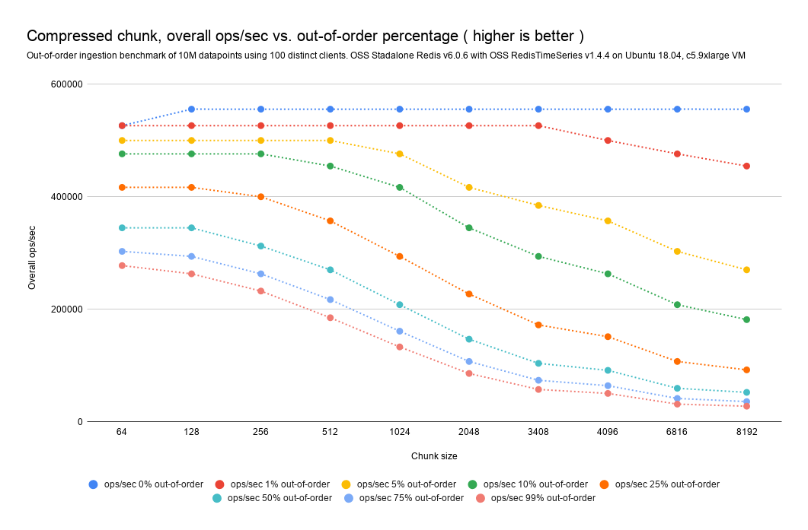
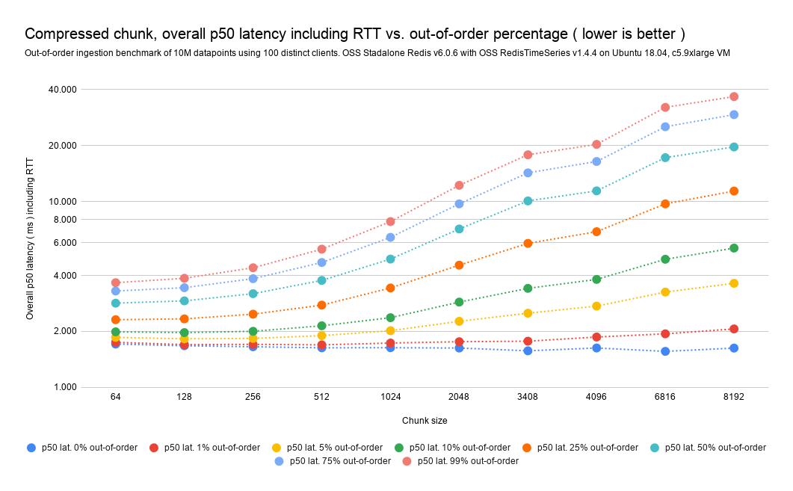
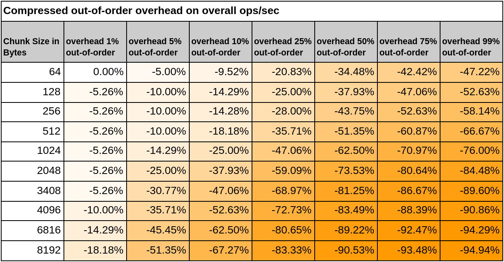

# Out-of-order / backfilled ingestion performance considerations

이전의 타임스탬프가 시계열 데이터에 삽입될 경우, 새로운 샘플의 타임프레임에 맞는 메모리 청크를 주 메모리에서 불러와야 할 수도 있습니다.
해당 청크가 압축된 청크라면, 삽입/수정 하기 전에 부호화가 진행되어야 합니다. 이러한 작업은 메모리를 많이 사용하며, 부호화의 경우 연산 자원을
많이 소모하여, 전체 수집 속도에 영향을 줄 수 있습니다.

수집 성능은 매우 중요하기에, 고성능 시계열 데이터베이스에 있어 백필 비율이 미치는 영향을 평가하고 이를 투명하게 공개하게 되었습니다.

그래서 Go 벤치마크 클라이언트를 제작하여, 순서 뒤바뀜 비율, 시계열의 압축, 동시에 사용되는 클라이언트 수, 명령어 파이프라인과 같은 
전체 시스템 성능을 좌우하는 핵심 요소들을 제어할 수 있도록 했습니다. 벤치마크 드라이버의 설정 정보들과 파라미터에 대해 알고 싶으시면 다음
링크를 참고하세요.
- https://github.com/RedisTimeSeries/redistimeseries-ooo-benchmark

이에 더해, 모든 벤치마크 테스트는 AWS 환경에서 실행되었으며, 저희의 벤치마크 테스팅 인프라로 구성되었습니다. 벤치마크 서버, 데이터베이스 서버
모두 별개의 c5.9xlarge 인스턴스에서 운용되었습니다. 테스트들은 단일 샤드 설정으로 진행되었고, RedisTimesSeries 버전 1.4를 사용했습니다.

# Compressed chunks out-of-order/backfilled impact analysis
***
압축된 청크의 경우, 하나의 순서가 뒤바뀐 데이터 포인트만으로도 전체 청크를 double delta 방식으로 전체 디코딩해야 할 수도 있습니다. 따라서,
순서가 뒤바뀐 데이터를 쓸 때 더 큰 오버헤드가 발생할 수 있습니다.

일반적인 경우에서는 압축된 상태에서의 out-of-order 성능을 높이기 위해서는 청크 크기를 가능한 한 줄이는 것이 좋습니다. 작은 청크는 곧 double
delta 디코딩 시 연산량이 줄어든다는 뜻이며, 전체적인 영향을 줄일 수 있습니다. 단, 그만큼 압축률은 낮아질 수 있습니다.

다음의 그래프와 표들을 아래의 시사점을 가집니다:
- 만약 데이터베이스가 기본 청크 크기인 4096 바이트 설정으로 1%의 out-of-order 샘플을 받으면, 수집 속도는 10%의 떨어집니다.
- 더 큰 out-of-order 비율에서는(5%, 10%, 25%등) 전체 영향은 약 35%에서 75%까지 감소할 수 있습니다. 이 정도 수준에서는 청크 크기를 줄이는
것을 심히 고려해봐야 합니다.
- out-of-order의 수집 비율이 99%에 이를 경우, 처리 가능한 초당 작업 수가 최대 95%까지 떨어질 수 있습니다 (청크 크기를 줄이면 반절을 
완화할 수 있습니다).

- 출처: https://redis.io/docs/latest/develop/data-types/timeseries/out-of-order_performance_considerations/

- 출처: https://redis.io/docs/latest/develop/data-types/timeseries/out-of-order_performance_considerations/

- 출처: https://redis.io/docs/latest/develop/data-types/timeseries/out-of-order_performance_considerations/

# Uncompressed chunks out-of-order/backfilled impact analysis 
***
아래의 차트와 표를 통해 알 수 있듯이, 청크 크기는 out-of-order 수집이 전체 수집 성능에 미치는 영향의 정도에는 영향을 주지 않습니다.
즉, 청크 크기가 256바이트이든 4096바이트이든, out-of-order 수집으로 인한 기대 성능 저하 정도는 동일하게 나타납니다. 이 외에도,
이 외에도 다음과 같은 핵심 사항들을 관찰할 수 있습니다:
- 데이터베이스가 전체 샘플 중 1% 정도만 out-of-order 샘플을 받는하는 경우, 수집 속도에 대한 영향은 매우 적거나 측정 불가능할 정도로 
미미합니다.
- 하지만 out-of-order 비율이 5%, 10%, 혹은 25%처럼 높아질 경우, 전체 처리 성능은 약 5%에서 19% 정도 감소할 수 있습니다.
- 우리는 out-of-order 수집 비율이 99%에 이를 경우에도 최대 45%까지 ops/sec가 감소하는 것을 관찰한 바 있습니다.

- 출처: https://redis.io/docs/latest/develop/data-types/timeseries/out-of-order_performance_considerations/

- 출처: https://redis.io/docs/latest/develop/data-types/timeseries/out-of-order_performance_considerations/

- 출처: https://redis.io/docs/latest/develop/data-types/timeseries/out-of-order_performance_considerations/